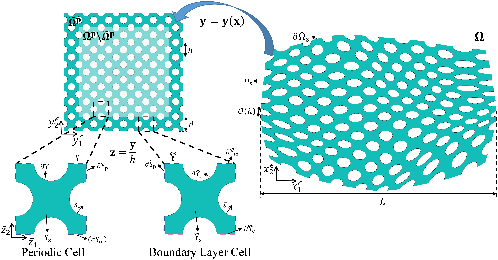



Hello, welcome to my homepage! My name is **Xiwei (Peter) Pan**, a native of the beautiful city of [Yangzhou](https://en.wikipedia.org/wiki/Yangzhou), China. I'm currently a master's student at [Dalian University of Technology (DUT)](https://www.dlut.edu.cn/) working with Prof. [Yichao Zhu](http://faculty.dlut.edu.cn/zhuyc/zh_CN/index/968943/list/index.htm). I am very interested in multiscale modeling of complex systems, with a focus on spatially varying multiscale configurations and plate/shell structures.

Before starting my master's program, I also earned a bachelor's degree in Engineering Mechanics (Qian Lingxi Excellence in Education Program) from DUT. There, I gained a strong foundation in fundamental yet crucial courses in mathematics, mechanics, and computer science.

My [Curriculum Vitae (CV)](/files/Xiwei_CV.pdf).

## News

<b>Sep 16, 2023</b>&nbsp;&nbsp;&nbsp;&nbsp;My first <a href="https://onlinelibrary.wiley.com/doi/abs/10.1002/nme.7367">research paper</a> was accepted by the <a href="https://onlinelibrary.wiley.com/journal/10970207"><em>International Journal for Numerical Methods in Engineering</em></a>!

<b>Jun 16, 2022</b>&nbsp;&nbsp;&nbsp;&nbsp;Graduated with the honor of <em>Outstanding Graduates of DUT, Class of 2022</em>

<b>Sep 28, 2021</b>&nbsp;&nbsp;&nbsp;&nbsp;Pre-admitted to Dalian University of Technology for master's study

<b>Jul 20, 2019</b>&nbsp;&nbsp;&nbsp;&nbsp;Attended the ACE Sustainable Civil Engineering Summer School at Cardiff University, UK

<b>Sep 01, 2018</b>&nbsp;&nbsp;&nbsp;&nbsp;Admitted to Dalian University of Technology for undergraduate study

## [Selected Publications](https://xiweipan.vercel.app/en/projects/)

<meta charset="UTF-8">
<meta name="viewport" content="width=device-width, initial-scale=1.0">
<title>Thumbnail with Enlarged View</title>

<!-- Thumbnail Image -->

<!-- The Modal -->

  &times;
  
  

