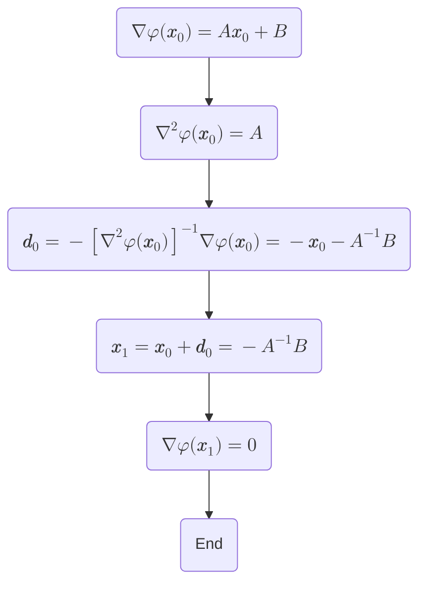

## Preface
For constrained optimization problems, we typically have two types of approaches: **direct methods** and **transformation methods**. The first approach directly solves the original problem, taking into account the impact of constraints on the searching direction and step size. These include *projected gradient methods*, *feasible direction methods*, and *the complex methods*, etc. The second approach can be further divided into two strategies. One involves incorporating the constraint functions from the original nonlinear programming problem into the objective function in a certain manner, thereby transforming it into an unconstrained optimization problem, with *penalty methods* and *augmented Lagrangian method* being specific examples. The other strategy seeks to convert the original constrained nonlinear programming problem into a series of simpler constrained problems, such as *linear or quadratic programming problems*, for example, through *sequential linear programming methods*.

This blog will focus on one such approach within the second category, namely the transformation to unconstrained optimization problems, discussing Lagrange multipliers, penalty methods, the augmented Lagrangian method, and the issue of ill-conditioning in penalty methods.

## The Method of Lagrange Multipliers
Let `$f:\mathbb{R}^n\to\mathbb{R}$` be the objective function, while `$\pmb{h}:\mathbb{R}^n\to\mathbb{R}^{m_1}$` and `$\pmb{g}:\mathbb{R}^n\to\mathbb{R}^{m_2}$` represent the inequality and equality constraint functions, respectively. Here, `$f,\pmb{g},\pmb{h}\in\mathcal{C}^1$`, meaning that their first-order derivatives are continuous. Consider a *general type* optimization problem with equality and inequality constraints:
`\begin{align}
\min\quad &f(\pmb{x}),\quad \pmb{x}=\left\{x_1,x_2,\,\cdots,x_n\right\}^\mathrm{T},\\
\mathrm{s.t.}\quad &\pmb{h}(\pmb{x})\leq\pmb{0}; \tag{1} \label{eq1}\\
&\pmb{g}(\pmb{x})=\pmb{0}.
\end{align}`

Based on the method of Lagrange multipliers (for equalities) and its generalization to inequalities, i.e., [the Kuhn-Tucker conditions](https://xiweipan.com/en/2025/04/09/kuhn-tucker-conditions/#mjx-eqn-eq15), the Lagrangian of Problem `$\eqref{eq1}$` is expressed by
`$$\mathcal{L}(\pmb{x},\pmb{\lambda},\pmb{\mu})=f(\pmb{x})+\pmb{\lambda}\cdot\pmb{h}(\pmb{x})+\pmb{\mu}\cdot\pmb{g}(\pmb{x}), \tag{2} \label{eq2}$$`
where `$\pmb{\lambda}=\left(\lambda_1,\,\cdots,\lambda_{m_1}\right)^\mathrm{T}$` and `$\pmb{\mu}=\left(\mu_1,\,\cdots,\mu_{m_2}\right)^\mathrm{T}$`. Therefore, the original extremum problem is equivalent to finding the *stationary point* of `$\mathcal{L}$`, treated as a function of `$\pmb{x}$`, `$\pmb{\lambda}$` and `$\pmb{\mu}$`, i.e., the optimality conditions to Problem `$\eqref{eq1}$` are
`\begin{align}
&\nabla_{\pmb{x}}\mathcal{L}=\nabla f+\pmb{\lambda}\cdot\nabla\pmb{h}+\pmb{\mu}\cdot\nabla\pmb{g}=\pmb{0};\\
&\pmb{\lambda}\cdot\pmb{h}=0,\ \pmb{h}\leq\pmb{0},\ \pmb{\lambda}\geq\pmb{0}\quad\text{(KT conditions)}; \tag{3} \label{eq3}\\
&\pmb{g}=\pmb{0}\quad\text{(Lagrange multiplier)},
\end{align}`
which, as we can see, is a straightforward outcome of combining the optimality conditions for both equality and inequality constraints.

## Penalty and Barrier Methods
### Penalty Methods
In the penalty methods, we seek to replace the original problem with an unconstrained one by adding *penalties* for the violation of the involved constraints. Unlike the method of Lagrange multiplier, which is theoretically accurate and can provide exact optimality point for simpler problems, the penalty methods discussed here are a type of 'intrinsically approximating' method. For the general type problem `$\eqref{eq1}$`, the penalty methods suggest that the corresponding 'combined objective' function should take the following form:
`\begin{align}
\varphi\left(\pmb{x},r_k,t_k\right)=f(\pmb{x})+\frac{r_k}{2}\sum_{i=1}^{m_1}\max\left(0,h_i(\pmb{x})\right)^2+\frac{t_k}{2}\sum_{j=1}^{m_2}g_j^2(\pmb{x}), \tag{4} \label{eq4}
\end{align}`

The above penalty parameters `$r_k,t_k$` are taken as two *progressively increasing positive sequences* to continuously strengthen the effect of the penalty term, thereby gradually guiding the minimum point of `$\varphi$` to the optimal point `$\pmb{x}^\ast$`. In this way, the unconstrained local/global minimizers are exactly the constrained local, respectively, global minimizers of `$f$` only if `$r_k,t_k\to\infty$`.

### Barrier Methods
A special type of penalty arises when the current minimizer lies within the feasible domain, ensuring that the constraints are not violated **from inside out**. That is, when the design point is about to cross the constraint boundary, the corresponding penalty term blows up to infinity, forming a '*barrier*' to prevent it from moving outside the feasible domain. This 'interior penalty' method, or simply the 'barrier' method can **only** be used in the case of inequality constrained problems (`$h_j(\pmb{x})\leq 0$`, `$j=1,2,\,\cdots,m$`), and the combined objective function is formulated as follows:
`$$\varphi\left(\pmb{x},r_k\right)=f(\pmb{x})+r_kP(\pmb{x}), \tag{5} \label{eq5}$$`
where the continuously differentiable penalty function `$P(\pmb{x})$` can be selected to be
`\begin{align}
P(\pmb{x})&=-\sum_{j=1}^m\frac{1}{h_j(\pmb{x})}\quad\text{Carrol barrier},\ \text{or}\\
P(\pmb{x})&=-\sum_{j=1}^m\ln\left(-h_j(\pmb{x})\right)\quad\text{Logarithmic barrier},
\end{align}`
or some other proper forms. The parameter `$r_k$` is a progressively decreasing positive sequence, it tends to 0 as the iteration number `$k\to\infty$`.

The advantage of the barrier function method lies in the fact that the intermediate design points it provides also satisfy the constraints, meaning that even if the optimal point is not reached, we can still obtain a series of feasible solutions that are an improvement over the initial values.

### Ill-conditioning
Both of the aforementioned methods can provide approximating optimal solutions through the intuitive addition of violation-preventing terms. However, they both **face the inherent contradiction between ensuring the satisfaction of constraints and avoiding ill-conditioning**. We will, in this subsection, try to explain how this issue haunts the application of penalty/barrier methods.

#### Steepest Descent Method
We first investigate the influence of [condition number](https://en.wikipedia.org/wiki/Condition_number) of the Hessian matrix `$\mathcal{H}$` on a type of unconstrained optimization method that explicitly relies on gradients, e.g., the steepest descent method. The basic gradient descent formulation is given by
`$$\pmb{x}_{k+1}=\pmb{x}_k-\delta\nabla\pmb{F}, \tag{6} \label{eq6}$$`
the step size `$\delta$` can be determined through [line search](https://en.wikipedia.org/wiki/Line_search). The Taylor expansion of a multivariate function `$\pmb{F}(\pmb{x})$` at the optimal point `$\pmb{x}^\ast$` is written as
`$$\pmb{F}(\pmb{x})=\pmb{F}(\pmb{x}^\ast)+\frac{1}{2}\tilde{\pmb{x}}^\mathrm{T}\mathcal{H}\tilde{\pmb{x}}+o\left(\tilde{\pmb{x}}^3\right), \tag{7} \label{eq7}$$`
where `$\tilde{\pmb{x}}=\pmb{x}-\pmb{x}^\ast$`, and `$\nabla\pmb{F}(\pmb{x}^\ast)=\pmb{0}$` is used to yield Equation `$\eqref{eq7}$`.

Assume that, after multiple iterations (`$k\to\infty$`), the current solution is near the optimal point. Therefore, the gradient of `$\pmb{F}$` near the minimum can be approximated by
`$$\nabla\pmb{F}(\pmb{x})\approx\mathcal{H}\tilde{\pmb{x}}, \tag{8} \label{eq8}$$`
note that the higher-order remainder `$o(\tilde{\pmb{x}}^2)$` vanishes as `$\tilde{\pmb{x}}$` approaches zero. Substituting Equation `$\eqref{eq8}$` into Equation `$\eqref{eq6}$` and subtracting `$\pmb{x}^\ast$` from both ends, we have
`$$\tilde{\pmb{x}}_{k+1}\approx\left(\pmb{I}-\delta\mathcal{H}\right)\tilde{\pmb{x}}^{k}, \tag{9} \label{eq9}$$`
which relates the current solution error (step `$k$`) to that of the next interation (step `$(k+1)$`). The [rate of convergence](https://en.wikipedia.org/wiki/Rate_of_convergence) can be expressed by
`$$\lim_{k\to\infty}\frac{\|\pmb{x}_{k+1}-\pmb{x}^\ast\|}{\|\pmb{x}_k-\pmb{x}^\ast\|}=\|\pmb{I}-\delta\mathcal{H}\|, \tag{10} \label{eq10}$$`
here `$\|\bullet\|$` represnts a norm, typically chosen to be the `$L^2$` norm (spectral norm).

For a [normal matrix](https://en.wikipedia.org/wiki/Normal_matrix) `$A$` satisfying `$A^\mathrm{H}A=AA^\mathrm{H}$`, where `$A^\mathrm{H}$` is the Hermitian transpose (or conjugate transpose) of `$A$`, it can be diagonalized using a [unitary matrix](https://en.wikipedia.org/wiki/Unitary_matrix), i.e., `$U^{-1}AU=\Lambda$`. In this case, the condition number of the matrix can be further related to its eigenvalues, i.e.,

`$$\kappa(A)=\|A\|\cdot\|A^{-1}\|=\sqrt{\lambda_\mathrm{max}\left(A^\mathrm{H}A\right)}\cdot \sqrt{\lambda_\mathrm{max}\left(A^\mathrm{-H}A^{-1}\right)}=\frac{\lambda_\mathrm{max}}{\lambda_\mathrm{min}}, \tag{11} \label{eq11}$$`
where `$\lambda_\mathrm{max}$` and `$\lambda_\mathrm{min}$` are the maximum and minimum eigenvalues of `$A$`, respectively.

Normal matrices include diagonal matrices, real (anti-)symmetric matrices, (anti-)hermitian matrices, orthogonal matrices, and unitary matrices, etc. Therefore, as a special case, the real symmetric matrix `$\pmb{I}-\delta\mathcal{H}$` can also be diagonalized by a unitary matrix, or more specifically, an orthogonal matrix `$P$`. This gives the relation
`$$P^\mathrm{T}(\pmb{I}-\delta\mathcal{H})P:=P^\mathrm{T}\pmb{H}P=\Lambda. \tag{12} \label{eq12}$$`

If we further assume the eigenvalues of the (`$n\times n$` positive-definite) Hessian to be `$0<\lambda_1<\,\cdots<\lambda_n$`, `$\Lambda=[1-\delta\lambda_1,\,\cdots,1-\delta\lambda_n]$`, and Equation `$\eqref{eq10}$` becomes:
`$$\|\pmb{I}-\delta\mathcal{H}\|=\sqrt{\lambda_\mathrm{max}\left(\pmb{H}^\mathrm{T}\pmb{H}\right)}=\max_j |1-\delta\lambda_j|<1, \tag{13} \label{eq13}$$`
the inequality shows the necessary condition for the algorithm to converge. According to Equation `$\eqref{eq13}$`, `$\delta<2/\lambda_n$`, so we could take `$\delta=c/\lambda_n\ (0<c<2)$`. Finally, the rate of convergence is expressed by
`$$\|\pmb{I}-\delta\mathcal{H}\|=\max_j |1-\delta\lambda_j|=|1-c\frac{\lambda_1}{\lambda_n}|, \tag{14} \label{eq14}$$`
note that, the term `$\frac{\lambda_1}{\lambda_n}$` is the reciprocal of `$\kappa(\mathcal{H})$`. Thus, the rate of convergence for the steepest descent method is directly related to the condition number of the Hessian, and, in particular, to the eigenvalues of the Hessian.

As `$(r_k,t_k)\to\infty$` (for penalty methods) or `$r_k\to 0$` (for barrier methods), the penalty terms dominate the objective function, leading to a loss of balance between eigenvalues associated with constraint gradients and `$\nabla^2 f$`. Specifically, the limit behavior of the penalty parameters causes a drastic increase in the eigenvalue associated with the constraint normal, while the eigenvalues corresponding to other directions remain smaller, resulting in a very large condition number `$\kappa(\mathcal{H})$`. From Equation `$\eqref{eq14}$`, we find that the rate of convergence approaches 1 as the penalty parameters tend to infinity (*sublinear convergence*). This implies that the gradient descent algorithm becomes increasingly inefficient and struggles to converge near the optimality, facing significant efficiency issues.

#### Newton's Method in Optimization
To address the above efficiency issues, one can resort to the [Newton's method](https://en.wikipedia.org/wiki/Newton%27s_method_in_optimization) for much faster convergence rate, which is **quadratically** fast near the optimal solution. For the optimization of (twice continuously differentiable) objective function `$\varphi$`, the Newton's method can be used to approximate the solution to equation `$\nabla\varphi(\pmb{x}^\ast)=0$`. Consider the second-order Taylor expansion of `$\varphi$` at the initial point `$\pmb{x}_0$` (omitting higher-order remainders):
`$$\varphi(\pmb{x})\approx\varphi(\pmb{x}_0)+\nabla\varphi(\pmb{x}_0)^\mathrm{T}(\pmb{x}-\pmb{x}_0)+\frac{1}{2}(\pmb{x}-\pmb{x}_0)^\mathrm{T}\nabla^2\varphi(\pmb{x}_0)(\pmb{x}-\pmb{x}_0), \tag{15} \label{eq15}$$`
according to the stationary point condition, the Newton's formulation for optimization is obtained:
`$$\pmb{x}_{k+1}=\pmb{x}_k-\left[\nabla^2\varphi(\pmb{x}_k)\right]^{-1}\nabla\varphi(\pmb{x}_k)=\pmb{x}_k-\mathcal{H(\pmb{x}_k)}^{-1}\nabla\varphi(\pmb{x}_k). \tag{16} \label{eq16}$$`

Next, we will prove the **local convergence** of Newton's method. It is reasonable to assume the *strong convexity* of `$\varphi$` and the [*Lipschitz-continuity*](https://en.wikipedia.org/wiki/Lipschitz_continuity) of gradients near the optimal point. If `$\varphi$` is strongly convex, there exists `$\mu>0$` such that `$\mathcal{H}(\pmb{x})=\nabla^2\varphi(\pmb{x})\succeq\mu\pmb{I},\ \forall\ \pmb{x}\in\mathrm{dom}(f)$`, where '`$\succeq$`' represents '`$\geq$`' in an elementwise sense. This condition implies that the minimum eigenvalue of its Hessian satisfies `$\lambda_\mathrm{min}\left(\mathcal{H}\right)\geq\mu$`. Thus, the `$L^2$` norm of the inverse Hessian satisfies the following relation:
`$$\|\mathcal{H}^{-1}\|=\frac{1}{\lambda_\mathrm{min}(\mathcal{H}(\pmb{x}))}\leq\frac{1}{\mu}. \tag{17} \label{eq17}$$`

The Lipschitz continuity states that, if `$\mathcal{H}(\pmb{x})$` is Lipschitz continuous, then there exists a real constant `$L>0$` such that for all real `$\pmb{x}$` and `$\pmb{y}$`, the inequality holds:
`$$\|\mathcal{H}(\pmb{x})-\mathcal{H}(\pmb{y})\|\leq L\|\pmb{x}-\pmb{y}\|,\ \forall\ \pmb{x},\pmb{y}\in\mathrm{dom}(f). \tag{18} \label{eq18}$$`

Subtracting `$\pmb{x}^\ast$` from both sides of Equation `$\eqref{eq16}$`, we get
`$$\tilde{\pmb{x}}_{k+1}=\tilde{\pmb{x}}_k+\mathcal{H}(\pmb{x}_k)^{-1}\left(\nabla\varphi(\pmb{x}^\ast)-\nabla\varphi(\pmb{x}_k)\right), \tag{19} \label{eq19}$$`
let `$g(k)=\nabla\varphi(\pmb{x}_k+k(\pmb{x}^\ast-\pmb{x}_k))$`, then,
`\begin{align}
\nabla\varphi(\pmb{x}^\ast)-\nabla\varphi(\pmb{x}_k)&=g(1)-g(0)=\int_0^1 g^\prime(k)\,\mathrm{d}k\\
&=\int_0^1\mathcal{H}(\pmb{x}_k+k(\pmb{x}^\ast-\pmb{x}_k))(-\tilde{\pmb{x}}_k)\,\mathrm{d}k. \tag{20} \label{eq20}
\end{align}`
Substituting Equation `$\eqref{eq20}$` into Equation `$\eqref{eq19}$` gives:
`\begin{align}
\tilde{\pmb{x}}_{k+1}&=\tilde{\pmb{x}}_k+\mathcal{H}(\pmb{x}_k)^{-1}\int_0^1\mathcal{H}(\pmb{x}_k+k(\pmb{x}^\ast-\pmb{x}_k))(-\tilde{\pmb{x}}_k)\,\mathrm{d}k\\
&=\mathcal{H(\pmb{x}_k)}^{-1}\int_0^1\left(\mathcal{H}(\pmb{x}_k+k(\pmb{x}^\ast-\pmb{x}_k))-\mathcal{H}(\pmb{x}_k)\right)(-\tilde{\pmb{x}}_k)\,\mathrm{d}k. \tag{21} \label{eq21}
\end{align}`

Taking the norm on both sides of Equation `$\eqref{eq21}$` yields:
`\begin{align}
\|\tilde{\pmb{x}}_{k+1}\|&\leq\|\mathcal{H}(\pmb{x}_k)^{-1}\|\cdot\|\int_0^1\left(\mathcal{H}(\pmb{x}_k+k(\pmb{x}^\ast-\pmb{x}_k))-\mathcal{H}(\pmb{x}_k)\right)(-\tilde{\pmb{x}}_k)\,\mathrm{d}k\|\\
&\leq\|\mathcal{H}(\pmb{x}_k)^{-1}\|\int_0^1\|\left(\mathcal{H}(\pmb{x}_k+k(\pmb{x}^\ast-\pmb{x}_k))-\mathcal{H}(\pmb{x}_k)\right)(-\tilde{\pmb{x}}_k)\|\,\mathrm{d}k\\
&\leq\|\mathcal{H}(\pmb{x}_k)^{-1}\|\int_0^1\|\left(\mathcal{H}(\pmb{x}_k+k(\pmb{x}^\ast-\pmb{x}_k))-\mathcal{H}(\pmb{x}_k)\right)\|\cdot\|-\tilde{\pmb{x}}_k\|\,\mathrm{d}k\\
&=\|\mathcal{H}(\pmb{x}_k)^{-1}\|\cdot\|-\tilde{\pmb{x}}_k\|\int_0^1\|\left(\mathcal{H}(\pmb{x}_k+k(\pmb{x}^\ast-\pmb{x}_k))-\mathcal{H}(\pmb{x}_k)\right)\|\,\mathrm{d}k, \tag{22} \label{eq22}
\end{align}`
with the strong convexity and Lipschitz continuity conditions (Equations `$\eqref{eq17}$` and `$\eqref{eq18}$`), Equation `$\eqref{eq22}$` is further simplified to:
`$$\|\tilde{\pmb{x}}_{k+1}\|=\|\pmb{x}_{k+1}-\pmb{x}^\ast\|\leq\frac{L}{2\mu}\|\pmb{x}^\ast-\pmb{x}_k\|^2\rightarrow\frac{\|\pmb{x}_{k+1}-\pmb{x}^\ast\|}{\|\pmb{x}_k-\pmb{x}^\ast\|^2}\leq\frac{L}{2\mu}. \tag{23} \label{eq23}$$`
Therefore, Newton's method is shown to exhibit local <b>quadratic</b> convergence near the optimal solution if the function is strongly convex and its gradients are Lipschitz continuous. This offers faster convergence compared to gradient descent methods, which converge sublinearly around the minimum. It is also worth mentioning that [this paper](https://arxiv.org/pdf/1806.00413v1) proved **the global linear convergence of Newton's method**, without requiring prior assumptions about the strong convexity of function or Lipschitz gradients.

In particular, for any quadratic function that is positive definite, e.g., `$\varphi(\pmb{x})=\frac{1}{2}\pmb{x}^\mathrm{T}A\pmb{x}+B^\mathrm{T}\pmb{x}+C$`, Newton's method can achieve the optimal solution with just one iteration. Assume the initial point is `$\pmb{x}_0$`, and the iteration process is listed below:

Although Newton's method excels the steepest descent method in terms of convergence, it *requires the calculation of the inverse Hessian*, which can also be problematic when dealing with ill-conditioned Hessians, leading to inaccurate or unstable results.

## Augmented Lagrangian Method
As can be seen, the otherwise simple and intuitive penalty/barrier methods are generally haunted by the ill-conditioning of the Hessian. Moreover, the constraints are only strictly satisfied as this ill-conditioning becomes increasingly severe. To address such a contradiction, augmented Lagrangian method (a.k.a. method of multipliers, proposed by Hestenes and Powell in 1969) comes to the rescue, which is more robust than traditional penalty methods.

For simplicity, we here consider the case of equality constraints `$\pmb{g}:\mathbb{R}^n\to\mathbb{R}^m$`. The augmented Lagrangian is defined as follows:
`$$\mathcal{L}_\rho(\pmb{x},\pmb{\lambda},\rho_k)=f(\pmb{x})+\pmb{\lambda}^\mathrm{T}\pmb{g}(\pmb{x})+\frac{\rho_k}{2}\pmb{g}^\mathrm{T}(\pmb{x})\pmb{g}(\pmb{x}), \tag{24} \label{eq24}$$`
as can be seen, the new Lagrangian incorporates penalty term into the original Lagrangian term, allowing this method to approximate the solution effectively with a **moderate** penalty parameter `$\rho_k$`. This leads to a reasonably conditioned problem, balancing the trade-off between constraint satisfaction and numerical stability.

Having obtained an estimate `$\lambda_k$` of `$\lambda$`, we select `$\pmb{x}_k$` to minimize the augmented Lagrangian `$\mathcal{L}_\rho$`. The stationary condition for Equation `$\eqref{eq24}$` gives:
`$$\nabla\mathcal{L}_\rho(\pmb{x}_k,\pmb{\lambda}_k,\rho_k)=\nabla f(\pmb{x}_k)+\left(\pmb{\lambda}_k+\rho_k\pmb{g}(\pmb{x}_k)\right)\cdot\nabla\pmb{g}(\pmb{x}_k)=\pmb{0}. \tag{25} \label{eq25}$$`

Comparing Equation `$\eqref{eq25}$` with the optimality condition given by the method of Lagrange multipliers `$\nabla\mathcal{L}=\nabla f+\pmb{\lambda}\cdot\nabla\pmb{g}$`, the update rule for multiplier `$\pmb{\lambda}$` can be chosen as
`$$\pmb{\lambda}_{k+1}=\pmb{\lambda}_k+\rho_k\pmb{g}(\pmb{x}_{k+1}), \tag{26} \label{eq26}$$`
where the penalty parameter `$\rho_k$` can be selected to either increase or, more simply, be **fixed** in order to penalize constraint violations. However, unlike (pure) penalty methods, where the value of the penalty parameter is directly linked with the accuracy of the problem, the penalty paramter here does <b>not</b> need to be pushed to infinity. Instead, it should only be large enough to enforce the positive definiteness of the Hessian of the Lagrangian `$\mathcal{L}_\rho$` (i.e., to counteract negative eigenvalues in the original Lagrangian's Hessian `$\nabla^2\mathcal{L}$`).

With the update rule (Equation `$\eqref{eq26}$`), Equation `$\eqref{eq25}$` changes to the form that is exactly consistent to the optimality condition of the original Lagrangian (with equality constraints). In summary, there goes three steps to run the augmented Lagrangian algorithm:
- Primal Step. Minimize the augmented Lagrangian with respect to `$\pmb{x}$`:
`$$\pmb{x}_{k+1}=\arg\min\limits_{\pmb{x}}\mathcal{L}_\rho(\pmb{x},\pmb{\lambda}_k,\rho_k).$$`
- Dual Update. Update the Lagrange multiplier `$\pmb{\lambda}$` through Equation `$\eqref{eq26}$`:
`$$\pmb{\lambda}_{k+1}=\pmb{\lambda}_k+\rho_k\pmb{g}(\pmb{x}_{k+1}).$$`
- Optionally, the penalty parameter `$\rho_k$` can be increased to enforce the constraints more strictly, or it can be simply selected as a (large) constant to ensure the positive definiteness of `$\nabla^2\mathcal{L}_\rho$`.

## References
1. [Optimization Related](https://www2.isye.gatech.edu/~nemirovs/OPTIIILN2024Spring.pdf)
2. [Ill-conditioning and condition number 1](https://www.cnblogs.com/RyanXing/p/ill-posed.html)
3. [Ill-conditioning and condition number 2](https://www.cnblogs.com/sddai/p/5933995.html)
4. [Rate of convergence](https://zhuanlan.zhihu.com/p/278151142)
5. [Local convergence of the Newton's method](https://zhuanlan.zhihu.com/p/293951317)